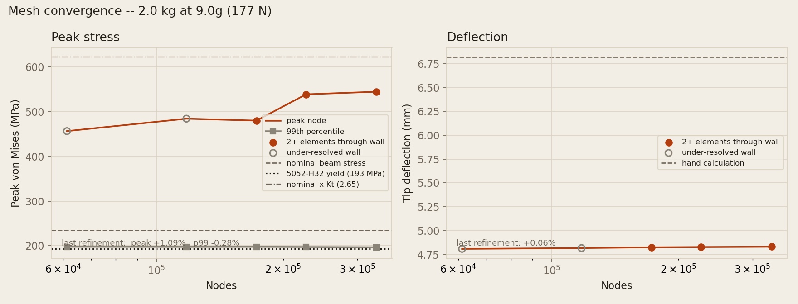

# 05 — Formed Sheet-Metal Bracket

An equipment mounting bracket: a base that bolts to structure, an upright
that bolts to the equipment, one 90° fold between them. Parametric, checked
against manufacturability rules before it is built, and drawn as both a
formed part and a flat pattern.

**Status:** Complete — forming arithmetic, DFM rule set, parametric solid,
flat pattern, STEP/DXF export, a detail drawing with a bend table, and 29
tests.
**Environment:** `pip install cadquery matplotlib pytest` (CadQuery 2.8,
Python 3.13). No pyOCC environment needed — CadQuery brings its own kernel.

```bash
python bracket.py        # build, run the DFM checks, export
python drawing.py        # drawings/SMB-001-bracket.png
python -m pytest -q      # 30 tests
```

## Why this part, when the portfolio already has machined ones

Sheet metal is its own discipline and nothing else here covers it. A
machined part is defined by what is cut away; a folded part is defined by
what the material will *survive being bent into*, and by the fact that the
shape a shop cuts is not the shape that gets installed. Every constraint
that makes it different is present in a part this simple:

- a minimum bend radius set by the alloy, not by the designer
- a minimum flange the press brake can physically grip
- holes that have to stay clear of the bend or be dragged oval by it
- fastener edge distances that decide whether a joint tears out
- a flat blank that is **shorter** than the finished part's legs added up

## The one calculation that matters

Bending stretches the outside of the material and compresses the inside.
Between the two is a neutral axis whose length does not change, and it sits
nearer the inside surface than the middle — at `K·T` from the inside face,
where K runs from about 0.33 on a tight bend to 0.45 on an open one.

```
bend allowance   BA = θ · (R + K·T)          material consumed by the fold
outside setback  OSSB = tan(θ/2) · (R + T)   tangent line to the sharp apex
bend deduction   BD = 2·OSSB − BA
flat length      L = Σ(outside legs) − Σ(BD)
```

For the reference bracket — 60 and 45 outside, 1.6 thick, R3, one 90° fold:

| | |
|---|---|
| Bend allowance | 5.718 mm |
| Outside setback | 4.600 mm |
| Bend deduction | 3.482 mm |
| **Flat length** | **101.52 mm** |
| Summed outside legs | 105.00 mm |

Cut the blank at 105 and every part in the batch is 3.5 mm long, in the
same direction, and nobody notices until assembly. That is the classic
sheet-metal error, and it is why the drawing dimensions the formed part and
puts the flat pattern alongside it rather than leaving the shop to guess.

## Validation: forming conserves volume

The flat-pattern arithmetic gets an independent check that owes nothing to
the formula it is testing. **Bending moves metal; it does not create or
destroy it**, so the blank and the formed part must have the same volume.

| | |
|---|---|
| Formed solid | 8010.83 mm³ |
| Flat blank | 7990.68 mm³ |
| Difference | **+0.25%** |

That residual is the K-factor model showing its size — a single linear
neutral axis against the exact toroidal geometry of the fillet — not an
error. For contrast, a blank cut to the summed outside legs would be
**5.12%** oversize, so the check discriminates comfortably between a right
answer and the obvious wrong one. It runs as a test.

### This check was too loose, and it hid a defect

It used to read **1.07%**, and it passed — while the formed part was
missing two of its four holes.

The upright pair was cut on a face-relative workplane whose frame put them
outside the material. CadQuery treats a hole that misses the solid as a
no-op rather than an error, so nothing complained. The part built,
exported, rendered, appeared on the site and passed every test with half
its hole pattern absent.

The volume check should have been the thing that caught it, and it is
worth being precise about why it did not. The missing holes *added* about
65 mm³ of material; the K-factor approximation *removed* about 85 mm³.
The two partly cancelled, leaving 1.07% — comfortably inside a bound set
at 2%.

So the check was measuring the right quantity and was set roughly four
times looser than the residual it was measuring. That is enough slack to
absorb a defect twice the size of the thing the test exists to detect.
The bound is now 0.5%, and a separate test counts holes on both solids,
because a volume comparison cannot tell material that was never removed
from material that was never there.

## Design for manufacture

`sheet_metal.py` holds the rules; `AngleBracket.violations()` returns every
one the design breaks, as a list rather than raising on the first, so a
design that is wrong three ways reports three problems instead of making
the designer fix and re-run three times.

| Rule | Requirement | This design |
|---|---|---|
| Minimum bend radius | ≥ material factor × T | R3 vs 1.6 required |
| Minimum flange | ≥ max(4T, R + 2T) | 45 vs 6.4 required |
| Hole edge to bend | ≥ R + 2T | 40.9 vs 6.2 required |
| Fastener edge distance | ≥ 2 × ⌀ | 12.0 vs 10.2 required |
| Minimum hole ⌀ | ≥ T | 5.1 vs 1.6 required |

### Why 5052-H32 and not 2024-T3

This is the material trade the bracket exists to demonstrate. 2024-T3 is
nearly twice as strong (435 vs 228 MPa) and is the obvious airframe choice
— but its minimum bend radius is **4T against 5052's 1T**. At 1.6 mm
thickness that is R6.4 rather than R1.6, which makes the specified R3 fold
impossible: it would crack the outside fibre.

A bracket like this is limited by stiffness and by the fasteners at its
ends, not by the sheet's tensile strength, so the strength is worth nothing
and the formability is worth a great deal. Ask for 2024-T3 anyway and the
DFM check says so:

```
MIN BEND RADIUS: 2024-T3 needs 4T (is 3.00, needs 6.40)
```

## Load case: the bracket does not survive 9g

The section above sizes the part to be *foldable*. Nothing so far asks
whether it can carry anything. This does: an avionics box on the upright at
a 9g crash factor, which is the case that sizes brackets like this one --
the 1g weight is trivial and never governs.

    2.0 kg x 9.81 x 9 = 176.6 N, pulling the upright away from the base

Fixed at the two base bolt holes, loaded at the two upright holes, solved
with CalculiX through FreeCAD's FEM stack. Both ship inside FreeCAD.app, so
this needs no GUI and no separate solver install:

```bash
/Applications/FreeCAD.app/Contents/MacOS/FreeCAD -c fea.py < /dev/null
python fea_figures.py     # base environment
```

### One element through the wall is not a mesh

The first attempt used 2.0 mm elements on 1.6 mm sheet. That puts **less
than one element through the thickness**, and a single element cannot carry
a linear stress gradient across itself -- bending is precisely what it
cannot represent. gmsh returned nonpositive Jacobians and CalculiX refused
the job outright (exit 201), which was the right answer. The same happened
at 1.6 mm.

Bending needs at least two quadratic elements through thickness, so the
element size is capped at **0.8 mm before any convergence argument begins**.
Runs coarser than that are reported below but are drawn hollow in the figure
and excluded from every conclusion. (The 1.2 mm case is genuinely marginal:
it was rejected on one run and solved on the next, because gmsh does not
produce an identical mesh each time.)

### What converged, and what did not

| element size | through wall | nodes | peak vM | 99th pct | deflection |
|---|---|---|---|---|---|
| 1.6 mm | 1.00 | 38,679 | *rejected* | — | — |
| 1.2 mm | 1.33 | 61,278 | 456.8 | 197.6 | 4.8089 |
| 0.9 mm | 1.78 | 117,809 | 484.6 | 197.4 | 4.8177 |
| **0.8 mm** | **2.00** | **172,832** | **480.3** | **197.6** | **4.8253** |
| **0.7 mm** | **2.29** | **226,641** | **539.1** | **197.2** | **4.8280** |
| **0.6 mm** | **2.67** | **333,230** | **545.0** | **196.7** | **4.8311** |

Across the three usable meshes, over a 1.9x range of node count:

- **deflection converges** -- +0.06% on the last refinement
- **the 99th-percentile stress converges** -- −0.28%
- **the peak stress does not** -- +12.2% then +1.1%, non-monotone, and
  spread over 12% across the three



### The peak is a boundary condition, not a stress

Refining a mesh should make an answer settle. When one quantity settles and
another climbs, the climbing one is usually not a property of the part. The
peak node's *location* says exactly what is happening here:

| element size | peak location (mm) | radius from bolt axis | hole |
|---|---|---|---|
| 0.9 mm | (45.49, 13.44, **0.00**) | **2.55** | +y |
| 0.8 mm | (45.48, −14.42, **0.00**) | 2.89 | −y |
| 0.7 mm | (45.66, 14.02, **0.00**) | **2.55** | +y |
| 0.6 mm | (45.87, 14.40, **0.00**) | **2.55** | +y |

Every peak sits at z = 0.00 exactly, at the bore radius of a constrained
hole -- the **edge of the fixed constraint**. A fixed boundary condition
applied to a face is mathematically singular at that face's boundary: the
elastic solution has no finite stress there, so the discrete answer simply
tracks element size and rises without limit forever. Refining further would
not help; it would produce a larger number and no more information.

And it **hops between the two holes** run to run. A real stress
concentration stays where the geometry puts it. This one goes wherever the
mesher happens to place the worst node, which is a second and independent
signature of a singularity.

So the honest reading is that **545 MPa is not a stress**. Quoting it would
be wrong in both directions at once: it overstates the severity 2.8-fold,
while the number that actually condemns the part is far less dramatic.

### The verdict

| | |
|---|---|
| Converged bulk stress (99th pct) | **196.7 MPa** |
| 5052-H32 yield | 193 MPa |
| **Margin of safety** | **−1.9%** |
| Converged deflection | 4.83 mm |

**The bracket is marginal at 9g and fails, but narrowly** -- it yields, it
does not tear. That is a different engineering conclusion from the 2.8x
overstress a naive reading of the peak would have given, and arriving at it
is the entire reason for running a convergence study rather than one mesh.

Independently, `beam_check.py` puts the nominal bending stress at
**235.1 MPa** on the same load case, from closed-form beam theory with no
solver involved -- also past yield, from a completely different direction.
Two methods that share no code agreeing that the part does not make it is
worth more than either one alone.

That hand calculation also surfaced something a single-cantilever
idealisation would miss: **most of the tip movement is the base rotating,
not the upright bending**, because the base reacts the moment back to the
bolts through the same 1.6 mm of material. Its 6.82 mm prediction is 41%
above the FEA's 4.83 mm, in the conservative direction a 1D model should
err, because it ignores the load spreading across the 50 mm width.

### What this analysis is not

- **Linear elastic.** Past yield, the real part redistributes stress and the
  linear answer overstates it. A margin this thin (−1.9%) is exactly where
  that matters, so "marginal fail" is the defensible claim, not a precise
  one.
- **Percentiles are a proxy.** The 99th percentile is taken over nodes, and
  node density is not uniform, so it is weighted toward refined regions. Its
  stability to 0.3% across a 1.9x node-count range is empirical evidence the
  bias is small here -- not a proof that it is.
- **No bolt model.** The constraint is a rigidly fixed bore. Real fasteners
  are compliant and load a bearing surface, which is both what softens the
  singularity in reality and what would be needed to check bearing and
  tear-out at the holes.
- **One direction.** Only the case that opens the bend was run. A real
  qualification sweeps the load through all axes.
- **Springback still unmodelled**, as noted below -- the analysis assumes
  the part comes off the press at nominal geometry.

### The fix, not run here

The section is the problem: stress goes as 1/t², so **2.0 mm gauge drops the
nominal from 235 to 150 MPa**, turning a −1.9% margin into **+28%** for 25%
more mass -- and halves the deflection, from 6.8 mm to 3.5 mm, which on a
bracket carrying avionics may matter more than the stress does. The
alternative is a stiffening rib or a formed flange along the upright's free
edges, which buys the margin through geometry instead of mass. Choosing
between them is a real design decision, and it is the natural next iteration
of this project.

## Files

| | |
|---|---|
| `sheet_metal.py` | Forming arithmetic, material table, DFM rules. No CAD dependency. |
| `bracket.py` | Parametric formed solid and flat pattern. |
| `drawing.py` | Detail sheet: formed views, flat pattern, bend table, notes. |
| `test_sheet_metal.py` | 30 tests. |
| `fea.py` | Headless CalculiX analysis and the mesh convergence sweep. Run under FreeCAD. |
| `beam_check.py` | Closed-form beam theory, the FEA's independent reference. No solver. |
| `fea_figures.py` | The convergence figure. |
| `test_beam_check.py` | 18 tests, including the FEA cross-checks. |
| `fea_results.json` | Sweep output. |
| `exports/` | `bracket-formed.step`, `bracket-flat.step`, `bracket-flat.dxf` |
| `drawings/SMB-001-bracket.png` | The drawing. |

The DXF is the flat profile only — the shape a laser or waterjet cuts.

## Outstanding

- **One bend.** A second fold (a Z or a channel) would exercise multiple
  bend deductions in series, which is where flat-pattern arithmetic
  actually gets error-prone.
- **No bend relief.** Not needed here, because the fold runs the full
  width. A partial-width flange needs relief notches at the ends of the
  bend or it tears at the corners.
- **No forming simulation** — springback is not modelled. Real press work
  overbends to compensate, by an amount that depends on the alloy, and this
  drawing does not tell the shop by how much.
- **Grain direction is a note, not a constraint.** Note 7 asks for bending
  with the grain; the geometry has no concept of it, so nothing enforces it.
- **Sized, but not resized.** The 9g load case above shows the bracket
  yielding with a −1.9% margin. The fix is scoped (2.0 mm gauge, or a
  stiffening rib) and not yet built — the part in `exports/` is still the
  failing one.
- **Bearing and tear-out at the holes are unchecked.** That needs a
  compliant bolt model, not the rigidly fixed bore used here.

---

See: [[01-Hydraulic-Actuator]] | [[02-Gearbox-Family]] | [[04-DFM-Optimizer]]
